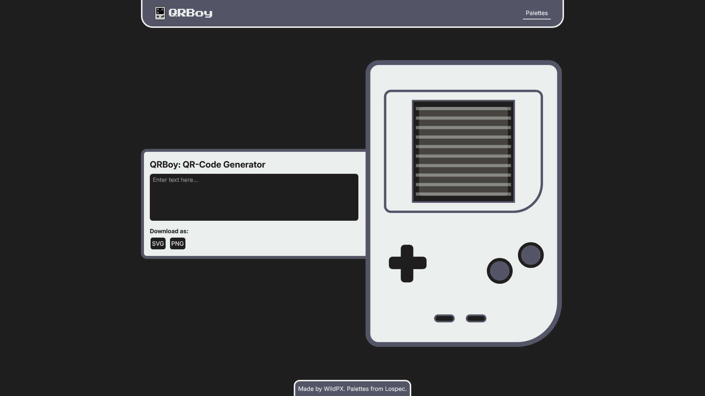

# QRBoy: Retro QR Code Generator

**QRBoy** is an interactive web application that generates QR codes within a retro handheld console-style frame.

## Key Features

- **Instant QR Code Generation:** Type any text or URL into the input field and watch the QR code generate in real-time.
- **Retro Handheld Aesthetic:** The QR code is displayed within a meticulously designed SVG that resembles a classic Game Boy, creating a unique and fun user experience.
- **Customizable Color Palettes:** Choose from a selection of curated 4-color palettes to customize the look of your QRBoy. The "Default" palette is applied on startup, but you can explore other themes inspired by retro gaming.
- **Export in SVG & PNG:** Download your generated QRBoy as a high-quality, scalable SVG or a web-ready PNG file, perfect for both digital and print use.

## Screenshot



## Built With

- [React](https://reactjs.org/)
- [Vite](https://vite.dev/)
- [CSS Modules](https://github.com/css-modules/css-modules)
- [Vitest & React Testing Library](https://vitest.dev/)
- [React-qr-code](https://github.com/rosskhanas/react-qr-code)

## Getting Started

1. Clone the repository:

```bash
git clone https://github.com/WildPX/qrboy.git
```

2. Navigate to project repository:

```bash
cd qrboy
```

3. Install the dependencies:

```bash
npm install
```

4. Run the application:

```bash
npm run dev
```

5. Open `http://localhost:5173` in browser.

## Links

- Project URL: [QRBoy](https://github.com/WildPX/QRBoy)
- Live Website URL: [Website]()

## Acknowledgments

- The color palettes used in this project are sourced from [Lospec](https://lospec.com/).
